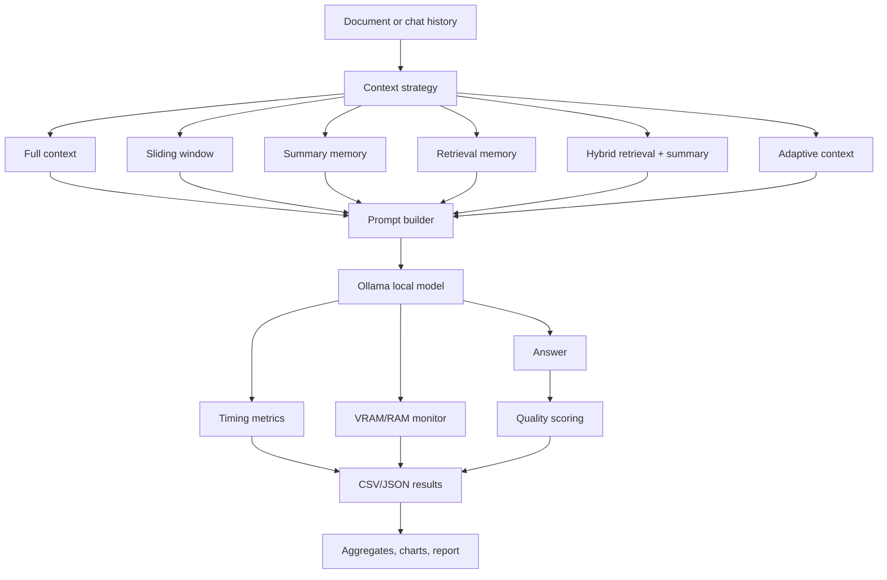
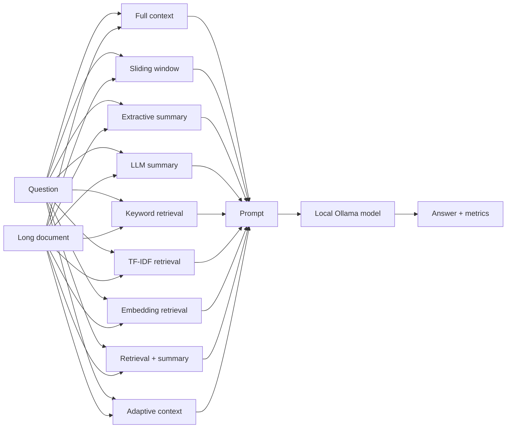
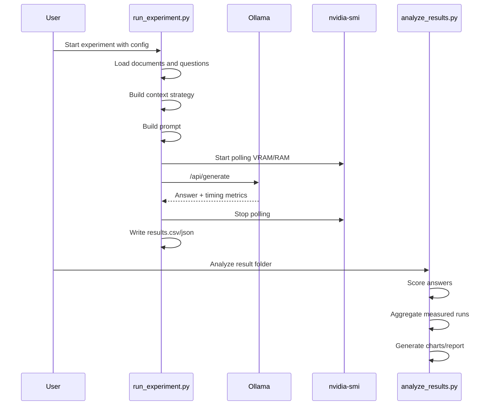
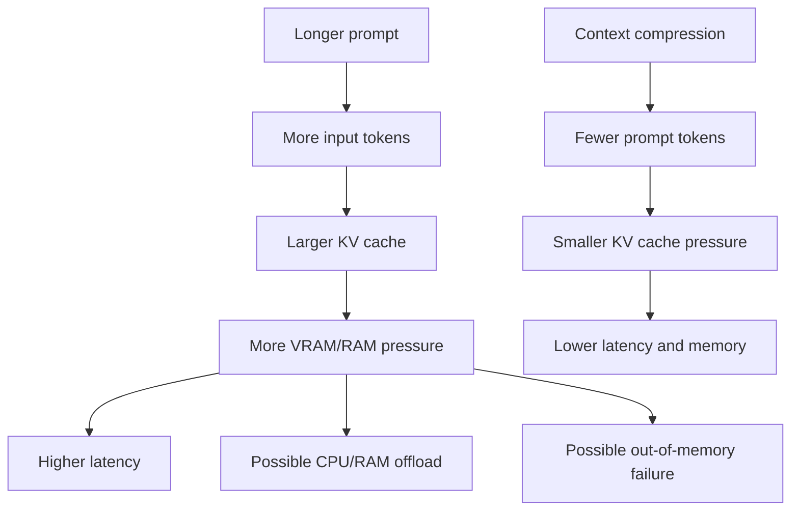
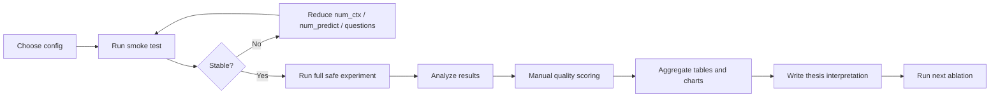
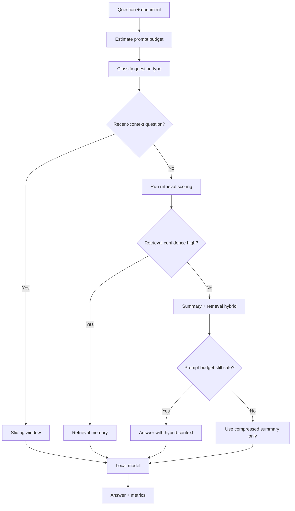
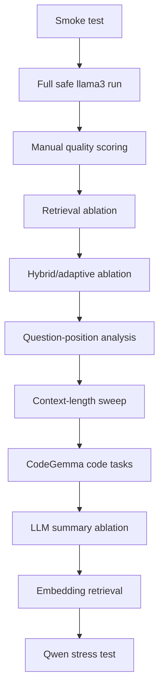

# Prompt-Level Context Strategies (Ollama arm)

The original experiment arm of this project. It compares ways of *choosing what
text to put in the prompt* — retrieval, summarisation, sliding windows — using
Ollama for inference.

These are prompt-construction strategies, not cache compression: they never
touch the KV cache, and the model never sees the discarded text. The two arms
answer different questions. Prompt-level methods reduce what enters the model;
KV compression reduces what the model retains after reading everything.

> **Status: exploratory / superseded.** This arm was the project's starting
> point and its results are preliminary smoke tests, as the sections below
> state. It is kept for provenance, not as a result.
>
> **The completed work is the KV-cache compression study** — 2,169 benchmark
> runs on RULER and Needle-in-a-Haystack, reported in the main
> [README](../README.md), with design notes in [kvcomp.md](kvcomp.md) and
> published aggregates in [results/](results/). Nothing on this page bears on
> those numbers.

---

This project is a local Ollama-based experiment framework for studying long-context inference on a machine with limited GPU memory. The practical question is simple:

```text
Can a local quantized LLM answer questions over long context without always sending the full context?
```

The research version is:

```text
How much context can be compressed or selectively retrieved before answer quality drops significantly, and how much latency, prompt length, and VRAM can be saved on a 6 GB GPU?
```

The project is intentionally built for a constrained Windows laptop setup, not for a large server. That constraint is the point of the work.

---

## Current Status

Implemented and tested:

- Ollama inference runner
- Windows PowerShell workflow
- NVIDIA VRAM polling through `nvidia-smi`
- Warmup runs and repeated measured runs
- Multiple context strategies
- Structured document/question dataset
- Expected-answer-point based automatic helper scoring
- Manual scoring template
- CSV/JSON result logging
- Aggregate result generation
- SVG chart generation without external Python packages
- Markdown report generation
- Conservative 6 GB safety policy
- Retrieval confidence metrics
- Hybrid `retrieval_plus_summary` context
- Budget-aware `adaptive_context`
- Derived metrics against full-context baselines
- Manual failure-mode labeling template
- Embedding retrieval cache under `.cache/embeddings`
- Budget sweep config generator
- Synthetic scaling dataset generator
- Smoke tests for `llama3:latest` and `codegemma:latest`

Tested machine:

```text
GPU: NVIDIA GeForce RTX 4050 Laptop GPU
VRAM: 6141 MiB
Python: 3.14.2
Ollama: installed and reachable at http://127.0.0.1:11434
```

Installed models detected during setup:

| Model | Local Size | Role |
|---|---:|---|
| `llama3:latest` | 4.7 GB | Safe baseline model |
| `codegemma:latest` | 5.0 GB | Code-task comparison model |
| `qwen3.5:9b` | 6.6 GB | Heavy stress-test model |

`qwen3.5:9b` is larger than detected VRAM. Treat it as a stress-test model, not as the safe baseline.

---

## Preliminary Results Already Obtained

These are smoke-test and validation results from this machine. They prove the pipeline runs end to end, but they are not enough for final thesis claims because they use one measured run and a small number of questions.

### Smoke Test: TF-IDF Retrieval

Run source:

```text
reports/smoke/
```

Result:

| Model | Method | Question | Ollama Prompt Tokens | Wall Time | Tokens/sec | Peak VRAM | Auto Quality |
|---|---|---|---:|---:|---:|---:|---:|
| `llama3:latest` | `retrieval_memory_tfidf` | `q_ml_kv_end` | 631 | 3.329 s | 19.652 | 5020 MiB | 2/3 |

### Adaptive Smoke Test

Run source:

```text
reports/adaptive_smoke/
```

Result:

| Model | Method | Prompt Tokens | Wall Time | Auto Quality | Token Saving vs Full | Latency Saving vs Full |
|---|---|---:|---:|---:|---:|---:|
| `llama3:latest` | `full_context` | 1425 | 10.627 s | 3/3 | 0.000% | 0.000% |
| `llama3:latest` | `retrieval_plus_summary` | 689 | 3.190 s | 2/3 | 51.649% | 69.982% |
| `llama3:latest` | `adaptive_context` | 686 | 3.278 s | 2/3 | 51.860% | 69.154% |

For this smoke test, `adaptive_context` selected:

```text
retrieval_plus_summary
```

Reason recorded by the runner:

```text
retrieval_confidence_below_threshold_but_hybrid_fits_budget
```

Interpretation:

```text
The adaptive/hybrid path reduced prompt tokens and latency substantially, but automatic quality dropped from 3/3 to 2/3 on this single question. This is exactly why full safe runs and manual scoring are still required.
```

### CodeGemma Code Smoke Test

Run source:

```text
reports/code_smoke/
```

Result:

| Model | Method | Question | Ollama Prompt Tokens | Wall Time | Tokens/sec | Peak VRAM | Auto Quality |
|---|---|---|---:|---:|---:|---:|---:|
| `codegemma:latest` | `retrieval_memory_tfidf` | `q_code_bug` | 571 | 13.413 s | 9.727 | 5253 MiB | 2/3 |

Interpretation:

```text
CodeGemma works on the 6 GB GPU with conservative settings, but it is slower than llama3 in the available smoke tests. A full code-task comparison is still needed before claiming that CodeGemma is better or worse.
```

---

## How To Obtain Thesis-Grade Results

The preliminary results above are not enough. To obtain final results, run the experiments in this order.

### 1. Smoke Test

```powershell
.\scripts\run_smoke_test.ps1
```

Check:

```text
reports/smoke/experiment_summary.md
reports/smoke/scored_results.csv
```

### 2. Full Safe Baseline

```powershell
.\scripts\run_safe_experiment.ps1
```

This generates:

```text
results/latest/
reports/latest/
```

Inspect:

```text
reports/latest/aggregate_by_method.csv
reports/latest/aggregate_by_question.csv
reports/latest/derived_by_method.csv
reports/latest/manual_quality_template.csv
reports/latest/experiment_summary.md
```

### 3. Manual Scoring

Open:

```text
reports/latest/manual_quality_template.csv
```

Fill:

```text
manual_quality_score
failure_mode
manual_notes
```

Then rerun analysis:

```powershell
python scripts\analyze_results.py --results-dir results\latest --reports-dir reports\latest_manual --manual-scores reports\latest\manual_quality_template.csv
```

### 4. Adaptive Ablation

```powershell
.\scripts\run_adaptive_ablation.ps1
```

This is the key novelty experiment. It compares:

```text
full_context
retrieval_memory_tfidf
retrieval_plus_summary
adaptive_context
```

### 5. Retrieval Ablation

```powershell
python scripts\run_experiment.py --config config\safe_6gb_config.json --methods retrieval_memory_keyword retrieval_memory_tfidf --output-dir results\retrieval_ablation --clean-output
python scripts\analyze_results.py --results-dir results\retrieval_ablation --reports-dir reports\retrieval_ablation
```

### 6. Question-Position Tests

```powershell
python scripts\run_experiment.py --config config\safe_6gb_config.json --categories fact_near_beginning --output-dir results\beginning_facts --clean-output
python scripts\analyze_results.py --results-dir results\beginning_facts --reports-dir reports\beginning_facts

python scripts\run_experiment.py --config config\safe_6gb_config.json --categories fact_near_end --output-dir results\end_facts --clean-output
python scripts\analyze_results.py --results-dir results\end_facts --reports-dir reports\end_facts
```

### 7. Synthetic Scaling

```powershell
.\scripts\run_synthetic_scale.ps1
```

This tests approximate document sizes:

```text
1k, 2k, 4k, 8k tokens
```

### 8. Code Task Comparison

```powershell
.\scripts\run_code_tasks.ps1
```

### 9. Optional Qwen Stress Test

```powershell
python scripts\run_experiment.py --config config\safe_6gb_config.json --models qwen3.5:9b --methods retrieval_memory_tfidf --max-questions 1 --num-ctx 1024 --num-predict 60 --unsafe --output-dir results\qwen_stress --clean-output
python scripts\analyze_results.py --results-dir results\qwen_stress --reports-dir reports\qwen_stress
```

Use this only as a stress test because `qwen3.5:9b` is larger than detected VRAM.

---

## Research Design

### Goal

Reduce memory pressure, latency, and prompt length while preserving answer quality.

### Hardware Constraint

The project assumes a local GPU with about 6 GB VRAM. This matters because long prompts increase KV-cache memory, and KV cache competes with model weights and temporary buffers.

### Independent Variable

The main independent variable is the context strategy:

- full context
- sliding window
- summary memory
- retrieval memory
- hybrid retrieval + summary
- adaptive context selection

### Dependent Variables

Measured outputs:

- answer quality
- wall-clock latency
- prompt processing time
- generation time
- tokens per second
- approximate prompt tokens
- Ollama prompt tokens
- peak VRAM usage
- peak system RAM usage

### Research Question

```text
Under a 6 GB GPU constraint, which context strategy gives the best quality-latency-memory tradeoff for local quantized LLM inference?
```

### Hypotheses

H1:

```text
Full context gives strong answer quality but highest prompt length, latency, and memory pressure.
```

H2:

```text
Sliding window is cheap but fails when the answer is outside the recent window.
```

H3:

```text
Summary memory reduces prompt length but can lose exact facts, numbers, names, and code details.
```

H4:

```text
Retrieval memory gives the best quality-cost tradeoff when relevant chunks are selected correctly.
```

H5:

```text
Heavier models may improve answer quality for some tasks but become slower or less practical under 6 GB VRAM.
```

H6:

```text
Code-specialized models may perform better on code-context tasks, but not necessarily on general document tasks.
```

---

## Why This Project Is Worth Studying

Most long-context discussions assume cloud GPUs or large memory budgets. This project focuses on the opposite case:

```text
local model + quantized weights + 6 GB GPU + long document or chat history
```

That creates a useful research gap:

- Quantization reduces model weight memory.
- It does not remove the cost of prompt processing.
- It does not eliminate KV-cache growth.
- Long-context use can still become slow or memory-heavy.

The core thesis angle is not "make the largest context possible." The stronger angle is:

```text
Find the smallest useful context that preserves answer quality.
```

That is more realistic for local LLM deployment.

---

## Core Pipeline



---

## Context Strategies

### 1. Full Context

The full document is sent to the model.

Best use:

- upper-bound answer quality
- baseline comparison
- small documents

Weakness:

- largest prompt
- largest KV-cache pressure
- highest prompt processing cost

Prompt shape:

```text
Document:
[complete document]

Question:
[question]
```

### 2. Sliding Window

Only the most recent part of the document or chat is sent.

Best use:

- recent chat history
- questions about the end of a document
- low-memory baseline

Weakness:

- loses earlier facts
- fails on "fact near beginning" questions

Prompt shape:

```text
Recent context:
[last N approximate tokens]

Question:
[question]
```

### 3. Summary Memory: Extractive

The runner selects important sentences from the original document using document frequency and question overlap.

Best use:

- dependency-free compressed memory
- fast summary baseline
- safer than generated summaries because it uses original sentences

Weakness:

- still shallow
- may miss subtle multi-hop evidence

Implemented method:

```text
summary_memory_extractive
```

### 4. Summary Memory: LLM

The runner can ask a local LLM to summarize the document for the given question.

Best use:

- comparing extractive summary vs generated summary
- studying whether summary quality is worth extra latency

Weakness:

- adds an extra model call
- can introduce summary errors
- not enabled in the safe default config

Implemented method:

```text
summary_memory_llm
```

### 5. Retrieval Memory: Keyword

The document is chunked. Chunks are scored by keyword overlap with the question.

Best use:

- transparent baseline retrieval
- no dependencies
- easy explanation in thesis

Weakness:

- misses semantic matches
- depends strongly on exact words

Implemented method:

```text
retrieval_memory_keyword
```

### 6. Retrieval Memory: TF-IDF

The document is chunked. Query and chunk vectors are built with TF-IDF, then ranked by cosine similarity.

Best use:

- stronger CPU-only retrieval
- no external package required
- good practical baseline for 6 GB GPU systems

Weakness:

- still lexical, not true semantic embedding retrieval

Implemented method:

```text
retrieval_memory_tfidf
```

### 7. Retrieval Memory: Embedding

The runner can call an Ollama embedding model and compare dense vector similarity.

Best use:

- semantic retrieval comparison
- stronger retrieval experiment

Weakness:

- requires an embedding model
- adds extra computation
- not enabled by default

Implemented method:

```text
retrieval_memory_embedding
```

Expected embedding model:

```text
nomic-embed-text:latest
```

Install only if you want to run embedding retrieval:

```powershell
ollama pull nomic-embed-text
```

### 8. Retrieval Plus Summary

This is the implemented hybrid method.

It combines:

```text
short global summary + top-k TF-IDF retrieved chunks
```

Prompt shape:

```text
Summary:
[short extractive summary]

Retrieved chunks:
[top relevant chunks]

Question:
[question]
```

Best use:

- questions that need both global orientation and exact evidence
- cases where pure retrieval may miss the broader context
- 6 GB systems where full context is too expensive

Implemented method:

```text
retrieval_plus_summary
```

### 9. Budget-Aware Adaptive Context

This is the implemented novel method.

It chooses a context strategy automatically using:

- document length
- question category
- prompt budget
- retrieval confidence
- hybrid context size

Current policy:

```text
small document -> full_context
recent/end question -> sliding_window
high retrieval confidence -> retrieval_memory_tfidf
low retrieval confidence and hybrid fits budget -> retrieval_plus_summary
low retrieval confidence and hybrid too large -> summary_memory_extractive
```

Implemented method:

```text
adaptive_context
```

The runner records the decision in:

```text
adaptive_selected_method
adaptive_reason
adaptive_prompt_budget
adaptive_confidence_threshold
```

---

## Method Comparison Diagram



---

## Project Structure

```text
D:\projects\Kv
  config/
    safe_6gb_config.json
    thesis_safe_config.json
    stress_test_config.json
    code_tasks_config.json
    synthetic_scale_config.json
    budget_sweeps/

  data/
    ml_long_document.txt
    documents/
      ai_survey_long.txt
      transformer_notes.txt
      research_paper_excerpt.txt
      long_chat_history.txt
      codebase_documentation.txt
      synthetic_scale_1000.txt
      synthetic_scale_2000.txt
      synthetic_scale_4000.txt
      synthetic_scale_8000.txt
    questions/
      thesis_questions.json
      synthetic_scale_questions.json

  scripts/
    check_environment.py
    run_experiment.py
    analyze_results.py
    generate_budget_sweeps.py
    generate_synthetic_documents.py
    run_adaptive_ablation.ps1
    run_budget_sweep_preview.ps1
    run_smoke_test.ps1
    run_safe_experiment.ps1
    run_code_tasks.ps1
    run_synthetic_scale.ps1
    run_analysis.ps1

  results/
    smoke/
    latest/
    code_smoke/

  reports/
    smoke/
    latest/
    code_smoke/
```

---

## Important Files

### `scripts/run_experiment.py`

Main experiment runner.

Responsibilities:

- load config
- load documents
- load structured questions
- build context using selected method
- build prompt
- run Ollama
- monitor VRAM/RAM
- record timing and model metrics
- store results as CSV and JSON
- enforce 6 GB safety policy

### `scripts/analyze_results.py`

Analysis and reporting script.

Responsibilities:

- load `results.csv`
- score answers against expected answer points
- generate manual scoring template
- aggregate measured runs
- exclude warmup runs from aggregates
- generate SVG charts
- generate Markdown report

It also writes derived comparison metrics such as token saving, quality retention, latency saving, VRAM saving, and tradeoff score when a `full_context` baseline exists in the same result set.

### `scripts/generate_budget_sweeps.py`

Generates config files for context-budget ablations.

It varies:

- `summary_tokens`
- `retrieval_top_k`
- `retrieval_chunk_tokens`

Generated configs are written under:

```text
config/budget_sweeps/
```

### `scripts/generate_synthetic_documents.py`

Generates synthetic scaling documents and matching questions.

Default synthetic targets:

```text
1000, 2000, 4000, 8000 approximate tokens
```

This supports scaling experiments without manually writing long documents.

### `data/questions/thesis_questions.json`

Structured question set.

Each question includes:

- question id
- document id
- category
- question text
- expected answer points

Example:

```json
{
  "id": "q_ml_kv_end",
  "document_id": "ml_long_document",
  "category": "memory_kv_cache",
  "question": "Why do long prompts become a problem on a 6 GB GPU?",
  "expected_points": [
    {
      "label": "long prompts increase KV cache",
      "keywords": ["long prompts", "KV cache"]
    }
  ]
}
```

---

## Config Files

### `config/safe_6gb_config.json`

Default safe experiment config.

Use this for normal thesis runs on the 6 GB GPU.

Default model:

```text
llama3:latest
```

Default methods:

```text
full_context
sliding_window
summary_memory_extractive
retrieval_memory_keyword
retrieval_memory_tfidf
retrieval_plus_summary
adaptive_context
```

Default run design:

```text
warmup_runs = 1
repeat_runs = 3
num_ctx = 2048
num_predict = 160
```

Default adaptive/hybrid settings:

```text
hybrid_summary_tokens = 220
hybrid_retrieval_top_k = 2
adaptive_full_context_max_document_tokens = 700
adaptive_prompt_token_budget = 1500
adaptive_retrieval_confidence_threshold = 0.04
```

### `config/thesis_safe_config.json`

Similar to safe config, separated for thesis runs. Use this when you want a clean named run directory.

### `config/stress_test_config.json`

Controlled stress-test config.

Default:

```text
llama3:latest
num_ctx = 4096
```

Use this after safe runs are stable.

### `config/code_tasks_config.json`

Code-specific config comparing:

```text
llama3:latest
codegemma:latest
```

Default:

```text
num_ctx = 1024
```

This is conservative because `codegemma:latest` is heavier than the llama3 baseline.

### `config/synthetic_scale_config.json`

Generated by:

```powershell
python scripts\generate_synthetic_documents.py
```

Use it to test document length scaling at approximately:

```text
1k, 2k, 4k, and 8k tokens
```

The default synthetic config uses `llama3:latest` and compares full context, sliding window, TF-IDF retrieval, hybrid retrieval+summary, and adaptive context.

### `config/budget_sweeps/`

Generated by:

```powershell
python scripts\generate_budget_sweeps.py --max-questions 2
```

Use it to test context-budget sensitivity across summary length, retrieval top-k, and chunk size.

---

## Dataset Design

Current documents:

| Document ID | Purpose |
|---|---|
| `ml_long_document` | Core ML/KV-cache explanation |
| `ai_survey_long` | General AI concepts and beginning-fact tests |
| `transformer_notes` | Transformer/KV-cache technical notes |
| `research_paper_excerpt` | Research-design and variables |
| `long_chat_history` | Chat memory simulation |
| `codebase_documentation` | Code-related long-context tasks |
| `synthetic_scale_1000` to `synthetic_scale_8000` | Controlled scaling tests generated by script |

Current question categories:

| Category | Purpose |
|---|---|
| `fact_near_beginning` | Tests whether methods preserve early facts |
| `fact_near_end` | Tests whether sliding window works on recent facts |
| `memory_kv_cache` | Tests core project concept |
| `multi_hop` | Tests combining multiple related facts |
| `summary_question` | Tests high-level synthesis |
| `research_design` | Tests thesis-specific understanding |
| `code_related` | Tests CodeGemma/code-context behavior |

---

## Run Workflow

### Step 1: Check Environment

```powershell
python scripts\check_environment.py
```

Expected:

- Python version prints
- Ollama path prints
- `ollama list` prints installed models
- `nvidia-smi` prints GPU memory
- Ollama API is reachable

### Step 2: Run Smoke Test

```powershell
.\scripts\run_smoke_test.ps1
```

This runs:

```text
model: llama3:latest
method: retrieval_memory_tfidf
questions: 1
repeat_runs: 1
warmup_runs: 0
```

Use this before every major experiment.

### Step 3: Run Full Safe Experiment

```powershell
.\scripts\run_safe_experiment.ps1
```

This runs the safe config and automatically analyzes results.

### Step 4: Run Code Tasks

```powershell
.\scripts\run_code_tasks.ps1
```

This compares `llama3:latest` and `codegemma:latest` on the code document.

### Step 5: Analyze Any Result Folder

```powershell
python scripts\analyze_results.py --results-dir results\smoke --reports-dir reports\smoke
```

---

## Direct Command Recipes

### Dry Run Without Inference

Use this to verify prompt construction without calling Ollama:

```powershell
python scripts\run_experiment.py --config config\safe_6gb_config.json --max-questions 2 --dry-run --output-dir results\dryrun --clean-output
```

### Single Method, Single Question

```powershell
python scripts\run_experiment.py --config config\safe_6gb_config.json --methods retrieval_memory_tfidf --max-questions 1 --repeat-runs 1 --warmup-runs 0 --output-dir results\single_tfidf --clean-output
python scripts\analyze_results.py --results-dir results\single_tfidf --reports-dir reports\single_tfidf
```

### Compare Only Retrieval Methods

```powershell
python scripts\run_experiment.py --config config\safe_6gb_config.json --methods retrieval_memory_keyword retrieval_memory_tfidf --repeat-runs 3 --warmup-runs 1 --output-dir results\retrieval_compare --clean-output
python scripts\analyze_results.py --results-dir results\retrieval_compare --reports-dir reports\retrieval_compare
```

### Compare Full Context vs TF-IDF Retrieval

```powershell
python scripts\run_experiment.py --config config\safe_6gb_config.json --methods full_context retrieval_memory_tfidf --repeat-runs 3 --warmup-runs 1 --output-dir results\full_vs_tfidf --clean-output
python scripts\analyze_results.py --results-dir results\full_vs_tfidf --reports-dir reports\full_vs_tfidf
```

### Compare Full Context, Retrieval, Hybrid, And Adaptive

```powershell
.\scripts\run_adaptive_ablation.ps1
```

Equivalent direct command:

```powershell
python scripts\run_experiment.py --config config\safe_6gb_config.json --methods full_context retrieval_memory_tfidf retrieval_plus_summary adaptive_context --output-dir results\adaptive_ablation --clean-output
python scripts\analyze_results.py --results-dir results\adaptive_ablation --reports-dir reports\adaptive_ablation
```

### Generate Budget Sweep Configs

```powershell
python scripts\generate_budget_sweeps.py --max-questions 2
```

This writes configs under:

```text
config/budget_sweeps/
```

Review them before running the generated script:

```powershell
.\config\budget_sweeps\run_budget_sweeps.ps1
```

### Generate And Run Synthetic Scaling Documents

```powershell
.\scripts\run_synthetic_scale.ps1
```

This generates synthetic 1k, 2k, 4k, and 8k approximate-token documents and runs the scaling config.

### Run Only Beginning-Fact Questions

```powershell
python scripts\run_experiment.py --config config\safe_6gb_config.json --categories fact_near_beginning --output-dir results\beginning_facts --clean-output
python scripts\analyze_results.py --results-dir results\beginning_facts --reports-dir reports\beginning_facts
```

### Run Only End-Fact Questions

```powershell
python scripts\run_experiment.py --config config\safe_6gb_config.json --categories fact_near_end --output-dir results\end_facts --clean-output
python scripts\analyze_results.py --results-dir results\end_facts --reports-dir reports\end_facts
```

### Run CodeGemma Safely

```powershell
python scripts\run_experiment.py --config config\code_tasks_config.json --models codegemma:latest --num-ctx 1024 --output-dir results\codegemma_safe --clean-output
python scripts\analyze_results.py --results-dir results\codegemma_safe --reports-dir reports\codegemma_safe
```

### Run Qwen as a Stress Test

```powershell
python scripts\run_experiment.py --config config\safe_6gb_config.json --models qwen3.5:9b --methods retrieval_memory_tfidf --max-questions 1 --num-ctx 1024 --num-predict 60 --unsafe --output-dir results\qwen_stress --clean-output
python scripts\analyze_results.py --results-dir results\qwen_stress --reports-dir reports\qwen_stress
```

`--unsafe` is required because the configured safety policy blocks `qwen3.5:9b` by default.

---

## Output Files

The experiment runner writes:

```text
results/<run_name>/
  results.csv
  results.json
  run_metadata.json
  prompts/
```

The analysis script writes:

```text
reports/<run_name>/
  scored_results.csv
  aggregate_by_method.csv
  aggregate_by_question.csv
  derived_by_method.csv
  failure_modes.csv
  manual_quality_template.csv
  experiment_summary.md
  charts/
    latency_by_method.svg
    prompt_tokens_by_method.svg
    tokens_per_second_by_method.svg
    peak_vram_by_method.svg
    quality_vs_latency.svg
    token_saving_vs_full_by_method.svg
    tradeoff_score_by_method.svg
```

---

## Metrics Explained

### Approximate Prompt Tokens

Computed before inference using a regex tokenizer.

Use:

- safety checks
- rough prompt size estimate
- pre-run planning

Limitation:

```text
It is not the model's exact tokenizer.
```

### Ollama Prompt Tokens

Returned by Ollama as `prompt_eval_count`.

Use this in thesis tables when available.

### Prompt Evaluation Time

Time spent processing the prompt before answer generation.

Important because long context mainly hurts this stage.

### Generation Time

Time spent producing output tokens.

### Wall Time

End-to-end local time measured by the Python runner.

Includes:

- context construction
- Ollama call overhead
- prompt processing
- answer generation
- local runtime overhead

### Tokens Per Second

Computed from Ollama generation metrics:

```text
tokens_per_second = generated_tokens / generation_seconds
```

This measures output generation speed, not full prompt-processing speed.

### Peak VRAM

Collected by polling:

```powershell
nvidia-smi --query-gpu=memory.used --format=csv,noheader,nounits
```

Limitation:

```text
Polling can miss very short spikes.
```

### Peak RAM

Collected using Windows CIM memory statistics.

### Retrieval Confidence

For retrieval-based and hybrid methods, the runner records:

```text
retrieval_top_score
retrieval_second_score
retrieval_score_gap
retrieval_confidence
selected_chunk_ids
selected_chunk_scores
```

Current definition:

```text
retrieval_confidence = top_score - second_score
```

The adaptive controller uses this value. If confidence is above the configured threshold, it can use retrieval alone. If confidence is below the threshold, it tries `retrieval_plus_summary`.

---

## Derived Metrics Generated For Thesis Tables

The analysis script now computes these metrics when a `full_context` baseline exists for the same model, document, and question. They are written mainly to:

```text
reports/<run_name>/aggregate_by_question.csv
reports/<run_name>/derived_by_method.csv
```

### Compression Ratio

```text
compression_ratio = method_prompt_tokens / full_context_prompt_tokens
```

Lower is better, if quality is preserved.

### Token Saving

```text
token_saving_percent = 100 * (1 - method_prompt_tokens / full_context_prompt_tokens)
```

### Quality Retention

```text
quality_retention = method_quality_score / full_context_quality_score
```

### Latency Saving

```text
latency_saving_percent = 100 * (1 - method_latency / full_context_latency)
```

### VRAM Saving

```text
vram_saving_percent = 100 * (1 - method_peak_vram / full_context_peak_vram)
```

### Quality-Latency Efficiency

```text
quality_latency_efficiency = quality_score / wall_seconds
```

### Quality-Memory Efficiency

```text
quality_memory_efficiency = quality_score / peak_vram_mib
```

### Practical Tradeoff Score

One possible thesis score:

```text
tradeoff_score = quality_score / (1 + latency_seconds + peak_vram_mib / 6000)
```

Do not claim this is universal. Define it as a project-specific comparison score.

---

## Quality Scoring

Automatic scoring is based on expected answer points in:

```text
data/questions/thesis_questions.json
```

Score meaning:

| Score | Meaning |
|---:|---|
| 0 | No expected points matched |
| 1 | Weak answer |
| 2 | Mostly correct but incomplete |
| 3 | Most or all expected points matched |

Important:

```text
Automatic scoring is only a helper.
```

For thesis-grade evaluation:

1. Open `reports/<run>/manual_quality_template.csv`.
2. Read the answer.
3. Enter a human quality score.
4. Add a failure mode when the answer is weak or wrong.
5. Rerun analysis with manual scores.

Example:

```powershell
python scripts\analyze_results.py --results-dir results\latest --reports-dir reports\latest_manual --manual-scores reports\latest\manual_quality_template.csv
```

Allowed failure modes in the template:

```text
none
lost_early_fact
bad_retrieval
summary_omission
hallucination
partial_answer
memory_stress
code_mismatch
other
```

---

## Experiment Design Diagrams

### Run Lifecycle



### KV-Cache Pressure



### Thesis Evaluation Loop



---

## 6 GB VRAM Safety Policy

The default policy is intentionally conservative.

| Model | Safe Role | Default Safety |
|---|---|---|
| `llama3:latest` | Baseline | up to `num_ctx=4096` |
| `codegemma:latest` | Code comparison | up to `num_ctx=1024` |
| `qwen3.5:9b` | Heavy stress test | blocked unless `--unsafe` |

The runner stops before inference if:

- prompt tokens are too close to `num_ctx`
- model-specific `num_ctx` safety limit is exceeded
- model size is larger than detected VRAM and `--unsafe` is not used

The runner can abort after a run if:

- peak VRAM reaches the configured threshold

This is not overengineering. On a 6 GB GPU, controlled failure prevention is part of the research method.

---

## Computational Roadmap: What To Do Next

This is the most important section if you want to squeeze the maximum thesis value from the project.

### Phase 0: Confirm Stable Baseline

Run:

```powershell
.\scripts\run_smoke_test.ps1
```

Goal:

```text
Confirm Ollama, GPU monitoring, scoring, reports, and charts work.
```

Do not move forward if this fails.

### Phase 1: Full Safe Baseline

Run:

```powershell
.\scripts\run_safe_experiment.ps1
```

Goal:

```text
Compare full context, sliding window, extractive summary, keyword retrieval, TF-IDF retrieval, hybrid retrieval+summary, and adaptive context on llama3.
```

Expected result:

```text
TF-IDF retrieval should usually reduce prompt length while preserving useful quality.
Sliding window should fail on some beginning-fact questions.
Full context should be strong but more expensive.
```

### Phase 2: Question-Position Analysis

Run beginning-fact and end-fact subsets:

```powershell
python scripts\run_experiment.py --config config\safe_6gb_config.json --categories fact_near_beginning --output-dir results\beginning_facts --clean-output
python scripts\analyze_results.py --results-dir results\beginning_facts --reports-dir reports\beginning_facts

python scripts\run_experiment.py --config config\safe_6gb_config.json --categories fact_near_end --output-dir results\end_facts --clean-output
python scripts\analyze_results.py --results-dir results\end_facts --reports-dir reports\end_facts
```

Why this matters:

```text
It shows exactly where sliding window breaks.
```

This is strong thesis evidence because it connects method behavior to information location.

### Phase 3: Retrieval Ablation

Run:

```powershell
python scripts\run_experiment.py --config config\safe_6gb_config.json --methods retrieval_memory_keyword retrieval_memory_tfidf --output-dir results\retrieval_ablation --clean-output
python scripts\analyze_results.py --results-dir results\retrieval_ablation --reports-dir reports\retrieval_ablation
```

Goal:

```text
Show whether TF-IDF gives better retrieval quality than keyword overlap without needing GPU embeddings.
```

This is important because CPU-only TF-IDF is practical for 6 GB systems.

### Phase 3B: Hybrid And Adaptive Ablation

Run:

```powershell
.\scripts\run_adaptive_ablation.ps1
```

Goal:

```text
Compare full context, TF-IDF retrieval, retrieval_plus_summary, and adaptive_context directly.
```

This is the central novelty experiment. It tests whether the adaptive controller can approach full-context quality while using fewer prompt tokens and lower latency.

### Phase 4: Summary Ablation

Run extractive vs LLM summary:

```powershell
python scripts\run_experiment.py --config config\safe_6gb_config.json --methods summary_memory_extractive summary_memory_llm --max-questions 3 --output-dir results\summary_ablation --clean-output
python scripts\analyze_results.py --results-dir results\summary_ablation --reports-dir reports\summary_ablation
```

Goal:

```text
Test whether LLM-generated summaries improve answer quality enough to justify extra compute.
```

Be direct in interpretation:

```text
If LLM summary adds latency but does not improve score, it is not worth it under 6 GB constraints.
```

### Phase 5: Context-Length Sweep

Run increasing context sizes on `llama3:latest`:

```powershell
python scripts\run_experiment.py --config config\safe_6gb_config.json --num-ctx 1024 --methods full_context retrieval_memory_tfidf --output-dir results\ctx1024 --clean-output
python scripts\analyze_results.py --results-dir results\ctx1024 --reports-dir reports\ctx1024

python scripts\run_experiment.py --config config\safe_6gb_config.json --num-ctx 2048 --methods full_context retrieval_memory_tfidf --output-dir results\ctx2048 --clean-output
python scripts\analyze_results.py --results-dir results\ctx2048 --reports-dir reports\ctx2048

python scripts\run_experiment.py --config config\safe_6gb_config.json --num-ctx 4096 --methods full_context retrieval_memory_tfidf --output-dir results\ctx4096 --clean-output
python scripts\analyze_results.py --results-dir results\ctx4096 --reports-dir reports\ctx4096
```

Goal:

```text
Measure how latency, prompt tokens, and VRAM change as num_ctx increases.
```

Do not jump to 8192 first. On this GPU, build evidence gradually.

### Phase 6: Code-Specific Model Comparison

Run:

```powershell
.\scripts\run_code_tasks.ps1
```

Goal:

```text
Compare llama3 vs codegemma on code-context tasks.
```

Interpretation:

```text
If CodeGemma is better but slower, report the quality-latency tradeoff.
If CodeGemma is not better, report that specialization did not pay off for this dataset.
```

### Phase 7: Heavy Model Stress Test

Run only after safe results are complete:

```powershell
python scripts\run_experiment.py --config config\safe_6gb_config.json --models qwen3.5:9b --methods retrieval_memory_tfidf --max-questions 1 --num-ctx 1024 --num-predict 60 --unsafe --output-dir results\qwen_stress --clean-output
python scripts\analyze_results.py --results-dir results\qwen_stress --reports-dir reports\qwen_stress
```

Goal:

```text
Show what happens when the model size is larger than detected VRAM.
```

Do not present Qwen as a fair baseline unless you clearly state the memory disadvantage.

### Phase 8: Embedding Retrieval

Install embedding model:

```powershell
ollama pull nomic-embed-text
```

Run:

```powershell
python scripts\run_experiment.py --config config\safe_6gb_config.json --methods retrieval_memory_tfidf retrieval_memory_embedding --max-questions 3 --output-dir results\embedding_retrieval --clean-output
python scripts\analyze_results.py --results-dir results\embedding_retrieval --reports-dir reports\embedding_retrieval
```

Goal:

```text
Compare CPU-only TF-IDF retrieval against semantic embedding retrieval.
```

This can increase novelty, but only if you report the extra retrieval cost clearly. Embeddings are cached under `.cache/embeddings` so repeated runs avoid recomputing the same vectors.

---

## Most Novel Direction

The project now includes the adaptive controller. The novelty work is to evaluate it rigorously against fixed strategies.

### Implemented Novel Method

Name:

```text
Budget-Aware Adaptive Context Selection
```

Core idea:

```text
Do not choose one context method manually. Choose the cheapest method likely to answer the question under the current VRAM/context budget.
```

Example policy:

```text
1. If question is about recent chat, use sliding window.
2. If question has specific keywords, use retrieval.
3. If retrieval confidence is low, combine retrieval + summary.
4. If prompt budget allows and question is broad, use summary memory.
5. Use full context only when the document is small enough.
```

Adaptive controller diagram:



Why this is stronger:

```text
The thesis is no longer only comparing known methods. It also evaluates a practical decision policy for 6 GB local inference.
```

You can compare:

```text
full_context
sliding_window
summary_memory_extractive
retrieval_memory_tfidf
adaptive_context
```

The claim becomes:

```text
An adaptive context controller can approach retrieval/full-context quality while reducing prompt length and avoiding unsafe memory usage.
```

---

## Implemented Hybrid Method

Implemented method:

```text
retrieval_plus_summary
```

Prompt:

```text
Summary:
[short document summary]

Retrieved chunks:
[top-k chunks]

Question:
[question]
```

Why it matters:

```text
Summary gives global context.
Retrieval gives local evidence.
Together they can outperform either alone.
```

This is now part of the default safe config. The next task is not implementation; it is to measure when it beats pure retrieval and when the extra summary tokens are not worth it.

---

## Failure Modes To Track

Add manual notes for these cases:

| Failure Mode | Meaning |
|---|---|
| Lost early fact | Sliding window dropped needed evidence |
| Bad retrieval | Relevant chunk was not selected |
| Summary omission | Summary removed needed detail |
| Hallucination | Model added unsupported information |
| Partial answer | Model found one point but missed others |
| Memory stress | Model slowed down or approached VRAM limit |
| Code mismatch | Model misunderstood code-specific context |

This will make the thesis analysis much stronger than only reporting averages.

---

## How To Interpret Results

Do not only ask:

```text
Which method is best?
```

Ask:

```text
Best for what constraint?
```

Examples:

If full context has best quality but high latency:

```text
Full context is an accuracy upper bound, not the best practical method.
```

If sliding window is fast but fails beginning questions:

```text
Sliding window is only reliable when required evidence is recent.
```

If TF-IDF retrieval matches full context quality with fewer tokens:

```text
Retrieval is the best practical method for local constrained inference.
```

If CodeGemma is slower but better on code:

```text
Specialized models can improve domain quality but increase compute cost.
```

If Qwen is slow:

```text
The heavier model is not automatically better under VRAM constraints.
```

---

## What To Put In The Thesis

Recommended chapter structure:

1. Introduction
2. Background: transformers, attention, KV cache, quantization
3. Problem definition: local long-context inference under 6 GB VRAM
4. Methodology: full context, sliding window, summary, retrieval
5. Experimental setup: hardware, models, configs, documents, questions
6. Metrics: quality, latency, prompt tokens, VRAM, RAM, tokens/sec
7. Results: tables and charts
8. Analysis: tradeoffs and failure modes
9. Proposed adaptive/hybrid method
10. Conclusion and future work

Core thesis table:

| Model | Method | Quality | Prompt Tokens | Latency | Tok/s | Peak VRAM |
|---|---|---:|---:|---:|---:|---:|
| llama3 | full context | | | | | |
| llama3 | sliding window | | | | | |
| llama3 | summary | | | | | |
| llama3 | retrieval | | | | | |
| codegemma | retrieval | | | | | |
| qwen stress | retrieval | | | | | |

Core thesis graph:

```text
Quality score vs latency
```

Second graph:

```text
Prompt tokens vs quality score
```

Third graph:

```text
Peak VRAM vs method
```

---

## Practical Run Ladder

Use this order. Do not skip steps.



Recommended order:

1. `run_smoke_test.ps1`
2. `run_safe_experiment.ps1`
3. manual scoring
4. retrieval keyword vs TF-IDF
5. hybrid/adaptive ablation
6. beginning vs end question subsets
7. `num_ctx` sweep
8. code tasks
9. summary extractive vs LLM
10. embedding retrieval
11. Qwen stress test

---

## Current Limitations

Be honest about these in the thesis.

1. The dataset is small.
2. Automatic scoring is keyword/point based, not semantic grading.
3. VRAM polling can miss short spikes.
4. Approximate token count is not exact model tokenization.
5. LLM summary can introduce compression errors.
6. TF-IDF retrieval is lexical, not semantic.
7. Qwen stress tests may involve CPU/RAM offload.
8. Local thermal throttling may affect timing.

These are not project failures. They are scope boundaries.

---

## How To Make The Project More Novel

The strongest path is:

```text
fixed-method benchmark -> failure analysis -> adaptive context policy
```

Specific novelty upgrades:

### 1. Evaluate Adaptive Context Selection

The method is implemented. Evaluate whether it chooses between sliding, summary, retrieval, and hybrid context effectively based on:

- prompt budget
- document length
- question category
- retrieval confidence
- available VRAM policy

### 2. Use Retrieval Confidence In Analysis

The runner now stores:

- top score
- second-best score
- score gap
- number of matching chunks

Use this to decide whether retrieval is reliable.

### 3. Stress Hybrid Summary + Retrieval

The implemented hybrid method combines:

```text
short global summary + top-k detailed chunks
```

This is likely more useful than pure summary or pure retrieval for broad questions.

### 4. Add Context-Budget Sweep

For each method, test budgets:

```text
256 tokens
512 tokens
1024 tokens
2048 tokens
```

This gives a curve:

```text
quality vs context budget
```

That is more interesting than one fixed setting.

### 5. Add Failure Taxonomy

Manually label failures:

```text
retrieval miss
summary omission
sliding-window loss
model hallucination
memory stress
```

This turns raw metrics into real analysis.

### 6. Add Long-Document Scaling

Create or collect documents at:

```text
1k tokens
2k tokens
4k tokens
8k tokens
```

Then test how each method scales.

### 7. Add Codebase-Scale Tasks

Use real project files:

- one-file bug explanation
- multi-function tracing
- config explanation
- stack trace diagnosis

Compare:

```text
llama3 vs codegemma
```

### 8. Add Embedding Retrieval

Compare:

```text
keyword retrieval
TF-IDF retrieval
embedding retrieval
```

Report both quality and retrieval overhead.

---

## Best Next Implementation Tasks

If continuing development, implement these in order:

1. run and manually score the full safe baseline
2. run the adaptive ablation and compare against full context
3. run context-budget sweeps and identify the smallest useful context budget
4. run synthetic scaling at 1k, 2k, 4k, and 8k approximate tokens
5. calibrate `adaptive_retrieval_confidence_threshold`
6. add semantic embedding retrieval results if `nomic-embed-text` is installed
7. add model unload/cold-start control
8. add final thesis table exporter
9. expand the dataset with real PDFs, code files, and long chat logs
10. add cross-run statistical significance tests

Most valuable next code change:

```text
Add final thesis table export and confidence-threshold calibration.
```

Most valuable next experiment:

```text
Run full safe llama3 experiment, manually score it, then run adaptive ablation, retrieval ablation, and question-position analysis.
```

---

## Final Interpretation Target

The project should end with a defensible statement like:

```text
For local quantized LLMs under a 6 GB GPU constraint, full-context prompting is useful as an accuracy baseline but is not always the most practical strategy. Retrieval-based and hybrid context methods can preserve much of the answer quality while reducing prompt length and improving latency. Sliding window is efficient but unreliable when evidence is not recent. Heavier models may not provide practical gains when memory pressure causes slowdowns or offloading.
```

That is a realistic and defensible thesis conclusion.
